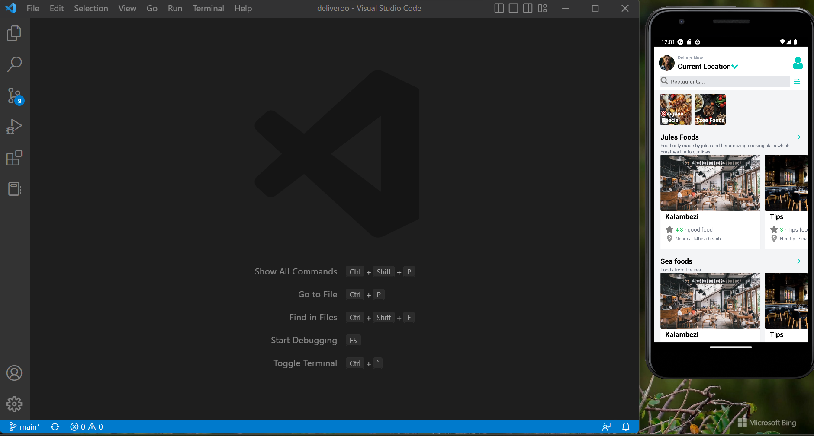
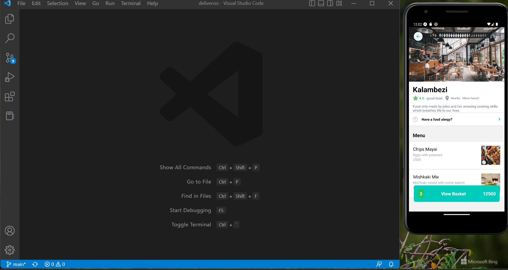
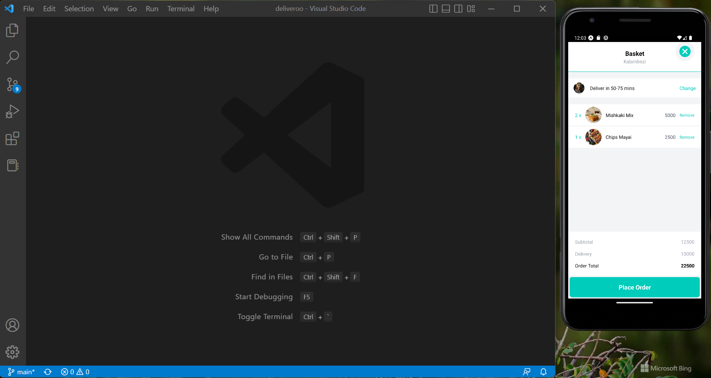
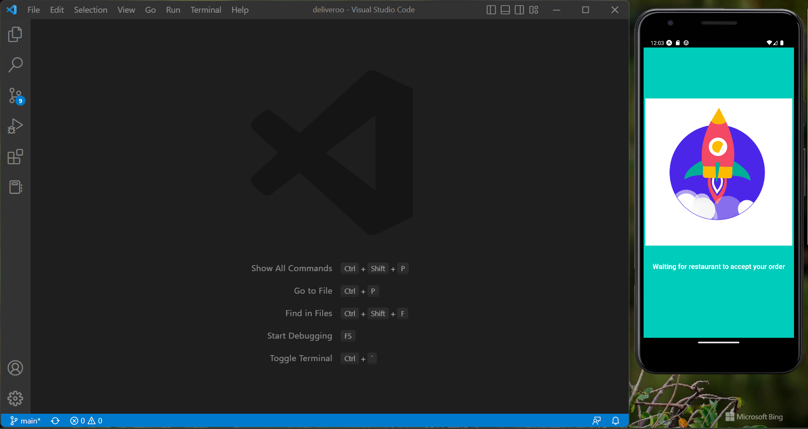
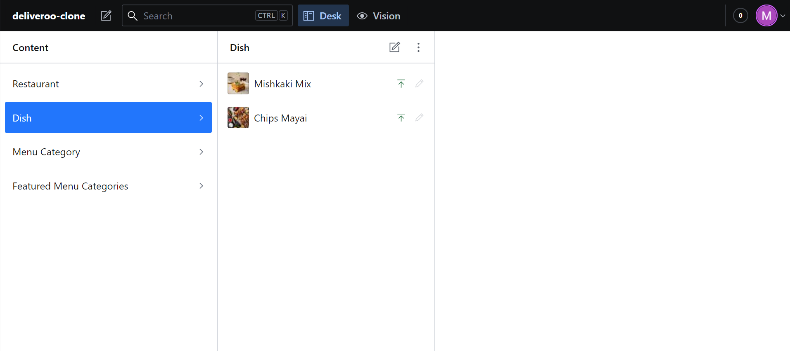
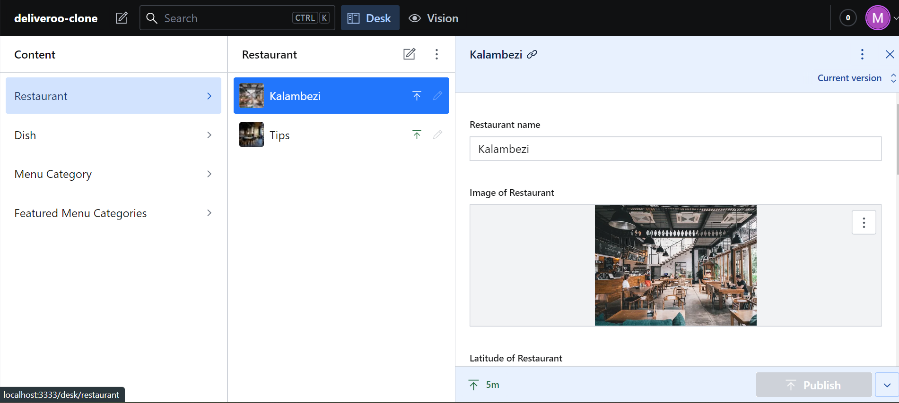

# Need a food delivery app?

This project is built with React Native with the help of expo's CLI which made things alot easier, so this app is a deliveroo clone where I'm displaying a design just the food delivery app. Where you could find your fav category of foods and have restaurants which have registered to have those said foods and once you have your pick. You can select the food then add to cart with an increment total all done using the state management tool Redux. As well as connected to a backend CMS SANITY where you could define the restaurants and categories of foods and they will show up on the app in real time.

### Some of it's features you ask?:blush:

- Tab Navigation as well as Drawer Navigation.
- Home page has multiple scroll view which line up vertically.
- Few screens include Home, Basket, Payment and Loading.

# Screenshots

### Home screen

### Restaurant screen

### Order screen

### Payment screen

### Sanity CMS

### Sanity CMS

